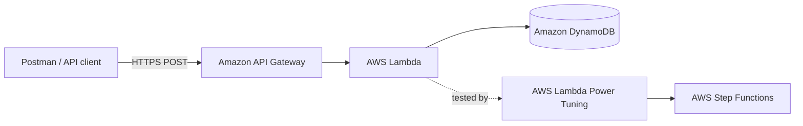

# AWS Serverless Microservice: Performance Testing and Lambda Power Tuning

I recently built and evaluated a serverless microservice using Amazon API Gateway, AWS Lambda, and Amazon DynamoDB. After validating the API, I used Postman Performance Testing to measure its end-to-end behavior under load and AWS Lambda Power Tuning to compare memory configurations based on execution time and estimated invocation cost.

The goal was not simply to choose the largest or smallest memory setting. It was to make a data-driven decision based on the workload's performance requirements and cost constraints.

## Architecture



### AWS services and tools

- **Amazon API Gateway** exposes the `POST /DynamoDBManager` endpoint.
- **AWS Lambda** processes each request and runs the requested DynamoDB operation.
- **Amazon DynamoDB** stores the application data.
- **AWS IAM** grants the Lambda function permission to access the table and write logs.
- **AWS Step Functions** orchestrates the Lambda Power Tuning tests.
- **Postman** validates the endpoint and generates concurrent traffic for the load test.

## API operations

The request body identifies the DynamoDB operation, table, and required payload. The Lambda function supports operations such as `create`, `read`, `update`, `delete`, and `list`.

Example request to list the table's items:

```json
{
  "operation": "list",
  "tableName": "lambda-apigateway",
  "payload": {}
}
```

## Performance-testing approach

I evaluated the microservice in two complementary ways:

1. **Postman Performance Testing** measured the complete request path—Postman to API Gateway, Lambda, DynamoDB, and back to the client—under concurrent traffic.
2. **AWS Lambda Power Tuning** invoked the Lambda function at multiple memory settings and compared average execution time with estimated invocation cost.

These results answer different questions and should not be compared as if they were the same latency measurement.

| Test | Question answered | Scope |
|---|---|---|
| Postman load test | How does the API behave under concurrent traffic? | End-to-end HTTP request |
| Lambda Power Tuning | Which Lambda memory setting best meets the cost or speed goal? | Lambda invocation |

## Postman load-test results

I configured a two-minute ramp-up test with 10 virtual users and sent `POST` requests to the API Gateway endpoint.


### Observed results

| Metric | Result |
|---|---:|
| Total requests | 2,223 |
| Average throughput | 18.49 requests/second |
| Average response time | 389 ms |
| P90 latency | 426 ms |
| P95 latency | 459 ms |
| P99 latency | 855 ms |
| Error rate | 0% |
| Failure rate | 0% |

The API completed all 2,223 requests without an error or failed test. Average latency remained around 389 ms while traffic ramped up. P95 latency was 459 ms, meaning 95% of requests completed within that time. P99 increased to 855 ms, showing that a small percentage of requests experienced higher tail latency.

The displayed peak CPU and memory values are Postman load-generator metrics; they are not Lambda CPU or memory-utilization measurements.

Possible areas to investigate for the P99 tail include Lambda cold starts, DynamoDB response variability, API Gateway overhead, and client-side or network latency. AWS CloudWatch metrics and AWS X-Ray traces would help isolate the source.

## Lambda Power Tuning

[AWS Lambda Power Tuning](https://github.com/alexcasalboni/aws-lambda-power-tuning) is an open-source Step Functions workflow that invokes a Lambda function at different memory configurations and generates a visualization of average duration and estimated cost.

I tested the function at `128`, `256`, `512`, and `1024` MB. Each setting was invoked 10 times with parallel invocation enabled and the optimization strategy set to `cost`.

### State-machine input

```json
{
  "lambdaARN": "YOUR_LAMBDA_ARN",
  "powerValues": [128, 256, 512, 1024],
  "num": 10,
  "payload": {
    "operation": "list",
    "tableName": "lambda-apigateway",
    "payload": {}
  },
  "parallelInvocation": true,
  "strategy": "cost"
}
```

### Tuning results


The results show a clear cost-performance tradeoff:

- **128 MB produced the lowest estimated invocation cost**, but it also had the longest execution time at approximately 3 seconds.
- **1024 MB produced the fastest execution**, approximately 0.7 seconds, but it had the highest estimated invocation cost among the tested settings.
- Increasing memory from 128 MB to 1024 MB reduced average Lambda execution time by roughly 77% in this test.
- The intermediate 256 MB and 512 MB settings provided additional price-performance choices between the two extremes.

Increasing Lambda memory also increases the CPU and other resources available to the function. More memory can therefore reduce execution time, but whether the faster execution offsets the higher price depends on the workload. For this run, the graph identifies 128 MB as **Best Cost** and 1024 MB as **Best Time**.

## Configuration decision

There is no universally correct Lambda memory setting:

- Choose **128 MB** when minimizing cost is the primary goal and approximately three-second function duration is acceptable.
- Choose **1024 MB** when minimizing processing time is more important than the additional invocation cost.
- Evaluate **256 MB or 512 MB** when the application needs a balance between cost and speed.

For a user-facing API, I would also consider the end-to-end latency objective before selecting the final configuration. The next validation step would be to select a memory setting and repeat the same Postman test under identical conditions. That would produce a controlled before-and-after comparison of average latency, P95, P99, throughput, and error rate.

The current screenshots do **not** represent a controlled before-and-after comparison. The 389 ms Postman value is end-to-end response time under load, while the Power Tuning graph reports Lambda invocation duration during a separate test.

## AWS Well-Architected alignment

This experiment supports two pillars of the [AWS Well-Architected Framework](https://docs.aws.amazon.com/wellarchitected/latest/framework/welcome.html):

- **Performance Efficiency:** select compute resources based on measured workload behavior and revisit the choice as usage changes.
- **Cost Optimization:** avoid overprovisioning while considering total price-performance instead of choosing memory by intuition.

The Postman test also provides evidence for the **Reliability** pillar because the API completed the test with a 0% error and failure rate. A longer test with multiple traffic profiles would be required before drawing production-readiness conclusions.

## How to reproduce the tests

### Run Lambda Power Tuning

1. Deploy `aws-lambda-power-tuning` from the AWS Serverless Application Repository and acknowledge that the application creates IAM roles.
2. Open AWS Step Functions and select the deployed `powerTuningStateMachine`.
3. Start an execution using the JSON input above after replacing `YOUR_LAMBDA_ARN`.
4. When the execution completes, open **Execution input and output**.
5. Copy the generated visualization URL and open it in a browser to review the cost and duration graph.

Power Tuning invokes the target function and can perform real database or external API operations. Use a safe test payload and understand the workload's side effects before running it.

### Run the Postman performance test

1. Create a Postman collection and add a request.
2. Set the method to `POST` and enter the deployed API Gateway URL.
3. Select **Body → raw → JSON** and add the `list` request shown above.
4. Save the request to the collection.
5. From the collection menu, select **Run**, and then select **Performance**.
6. Choose the **Ramp up** load profile, 10 virtual users, and a two-minute duration.
7. Run the test and review throughput, average response time, percentile latency, and errors.

Do not commit an API key, AWS credential, account-specific ARN, or private endpoint to the repository.

## Key takeaways

- Serverless performance decisions should be based on measurements rather than memory size alone.
- Higher Lambda memory can substantially reduce execution duration because it also provides more CPU.
- The cheapest configuration and fastest configuration may be different.
- Average latency alone is incomplete; P95 and P99 expose slower requests that affect user experience.
- Optimization is complete only after the selected configuration is validated again using the same load-test conditions.

## Cleanup

To avoid ongoing charges after completing the lab, remove resources that are no longer needed, including the API Gateway API, Lambda function, DynamoDB table, IAM role, and Lambda Power Tuning application/stack.

## References

- [Serverless microservice lab](https://github.com/saha-rajdeep/serverless-lab)
- [AWS Lambda Power Tuning](https://github.com/alexcasalboni/aws-lambda-power-tuning)
- [AWS Lambda performance optimization](https://docs.aws.amazon.com/lambda/latest/operatorguide/perf-optimize.html)
- [AWS Well-Architected Framework](https://docs.aws.amazon.com/wellarchitected/latest/framework/welcome.html)
